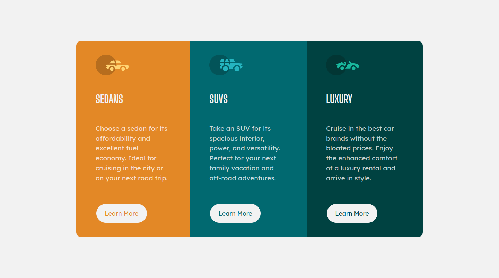

# Frontend Mentor - 3-Column Preview Card

---

## Welcome! :wave:

This is a solution to the [3-column preview card challenge on Frontend Mentor](https://www.frontendmentor.io/challenges/3column-preview-card-component-pH92eAR2-).
Frontend Mentor challenges help you improve your coding skills by building realistic projects.

## Overview

### The challenge

Users should be able to:

- View the optimal layout depending on their device's screen size
- See hover states for interactive elements

### Links

- Live Site URL: [GitHub Pages](https://jotahdavid.github.io/3-column-preview-card/)

### Screenshot

---

